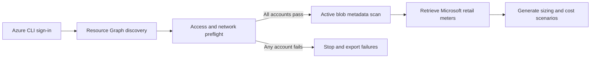

<div align="center">

# Azure Blob vaulted-backup estimator

**Read-only Blob inventory and evidence-based vaulted-backup cost planning**

[](https://learn.microsoft.com/powershell/)
[](https://learn.microsoft.com/cli/azure/install-azure-cli)
[](LICENSE)

</div>

Azure's storage-account capacity metrics are useful for planning, but they can
include versions, snapshots, and retained deleted objects. This utility
enumerates **active blob metadata** to establish a more defensible protected-data
baseline, then models vaulted-backup costs with current Microsoft retail rates.

> [!IMPORTANT]
> This is a planning tool, not an Azure quote. Future vault size depends on
> changed data, retention, policy scope, backup-generated writes, and commercial
> pricing.

## Highlights

| Capability | Behavior |
|---|---|
| Explicit scope | Scans only subscription IDs supplied at runtime |
| Safe preflight | Tests every account before allowing full enumeration |
| Metadata only | Never downloads blob content or requests storage keys |
| Exact active baseline | Measures active BlockBlob, AppendBlob, and PageBlob objects |
| Resumable | Checkpoints every completed account |
| Live rate evidence | Uses the Microsoft Azure Retail Prices API |
| Scenario modeling | Configurable retention, churn, and vault redundancy |
| Private by default | Generated assessment files are excluded by `.gitignore` |

## Workflow



## Requirements

- [PowerShell 7](https://learn.microsoft.com/powershell/scripting/install/installing-powershell)
- [Azure CLI](https://learn.microsoft.com/cli/azure/install-azure-cli)
- An authenticated Azure CLI session
- Network and DNS connectivity to storage private endpoints, when applicable

Azure Cloud Shell supports the preflight and smaller assessments. For large
estates, use a persistent PowerShell 7 host because a full metadata inventory
can outlast a Cloud Shell session. Rerunning with the same output directory
resumes from completed account checkpoints.

Required Azure roles on every target subscription:

| Role | Purpose |
|---|---|
| `Reader` | Discover storage accounts and configuration |
| `Storage Blob Data Reader` | List containers and active blob metadata |

`Cost Management Reader` isn't required for the forward estimate. It can be
added later to reconcile actual charges after vaulted backup begins billing.

## Quick start

### 1. Sign in

```powershell
az login --tenant <tenant-id>
```

### 2. Run the mandatory preflight

```powershell
pwsh ./Get-AzureBlobBackupEstimate.ps1 `
  -SubscriptionId "<subscription-id-1>","<subscription-id-2>" `
  -PreflightOnly `
  -OutputDirectory ./azure-blob-backup-results
```

The script stops here if any account has missing RBAC permissions, firewall
restrictions, private-DNS failures, or endpoint connectivity problems.

### 3. Run the full assessment

```powershell
pwsh ./Get-AzureBlobBackupEstimate.ps1 `
  -SubscriptionId "<subscription-id-1>","<subscription-id-2>" `
  -FullScan `
  -OutputDirectory ./azure-blob-backup-results
```

If execution is interrupted, run the same command with the same output
directory. Completed accounts are loaded from checkpoints instead of rescanned.

### Restrict accounts and enforce an expected count

```powershell
pwsh ./Get-AzureBlobBackupEstimate.ps1 `
  -SubscriptionId "<subscription-id-1>","<subscription-id-2>" `
  -AccountNamePrefix "exampledata" `
  -ExpectedAccountCount 25 `
  -PreflightOnly `
  -OutputDirectory ./azure-blob-backup-results
```

## Parameters

| Parameter | Required | Default | Description |
|---|:---:|---|---|
| `SubscriptionId` | Yes | — | One or more explicit subscription IDs |
| `AccountNamePrefix` | No | All accounts | Case-insensitive storage-account prefix |
| `ExpectedAccountCount` | No | `0` | Stops on count mismatch; `0` disables the check |
| `RetentionDays` | No | `10,33` | Daily recovery-point retention scenarios |
| `DailyChurnPercent` | No | `1,3,5` | Changed-data sensitivity scenarios |
| `VaultRedundancy` | No | `LRS,GRS,RA-GRS` | Vault billing redundancy scenarios |
| `OutputDirectory` | No | Timestamped directory | Assessment output and checkpoints |
| `PreflightOnly` | One mode required | — | Tests access and connectivity only |
| `FullScan` | One mode required | — | Performs enumeration and cost modeling |
| `Force` | No | Off | Rescans accounts with successful checkpoints |

## Cost model

For every storage account:

```text
protected-instance fee =
    ceiling(active BlockBlob GiB / 500 GiB) × protected-instance rate

modeled vault GiB =
    active BlockBlob GiB ×
    [1 + daily churn × (retention days - 1)]

estimated monthly cost =
    protected-instance fees + modeled vault-storage fees
```

Rates are selected by account region, Blob versus ADLS Gen2 account type, and
requested vault redundancy.

The estimate intentionally excludes:

- Backup-attributed write operations, because source write counts don't prove
  the operations generated by Azure Backup
- Restore and data-retrieval charges
- Taxes
- Enterprise agreement pricing and negotiated discounts

## Outputs

| File | Contents |
|---|---|
| `preflight.csv` | Access and network result for every discovered account |
| `account-sizing.csv` | Active blob bytes and object counts by account |
| `cost-scenarios.csv` | Monthly and annual planning scenarios |
| `pricing-evidence.json` | Meter IDs, rates, units, regions, and effective dates |
| `summary.json` | Machine-readable aggregate assessment |
| `README.txt` | Human-readable result summary |
| `account-results/` | Per-account restart checkpoints |

## Safety and privacy

The utility performs Azure Storage **List** operations only. It doesn't:

- Download or inspect blob content
- Retrieve storage-account keys
- Generate SAS tokens
- Create, update, or delete Azure resources

Blob listing generates normal storage transaction charges. Large estates can
take hours or longer because every active object must be listed.

> [!CAUTION]
> Generated output contains subscription IDs, resource-group names,
> storage-account names, inventory totals, and pricing information. Treat it as
> confidential and never commit it to a public repository.

The included `.gitignore` excludes the standard output paths. Always review
`git status` before committing.

## When enumeration isn't allowed

If `Storage Blob Data Reader` can't be approved, configure
[Azure Storage Inventory](https://learn.microsoft.com/azure/storage/blobs/blob-inventory)
to export an aggregate inventory containing blob type and content length. The
inventory can provide the same active-data baseline without granting the
operator direct data-plane access.

## References

- [Azure Blob backup overview](https://learn.microsoft.com/azure/backup/blob-backup-overview)
- [Azure Backup pricing](https://azure.microsoft.com/pricing/details/backup/)
- [Azure Retail Prices API](https://learn.microsoft.com/rest/api/cost-management/retail-prices/azure-retail-prices)
- [Storage Blob Data Reader](https://learn.microsoft.com/azure/role-based-access-control/built-in-roles/storage#storage-blob-data-reader)
- [List blobs REST API](https://learn.microsoft.com/rest/api/storageservices/list-blobs)

## License

Released under the [MIT License](LICENSE).
